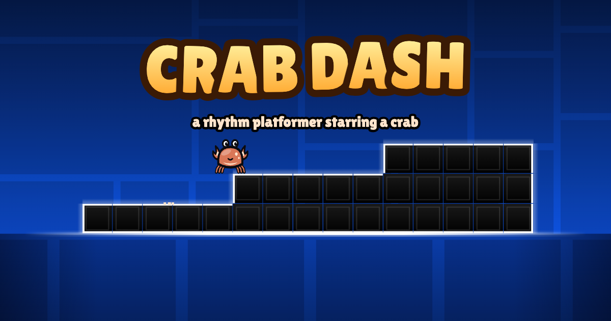

# Crab Dash

A one-button rhythm platformer starring a crab. Jump, fly and flip through six levels, from Easy to Demon.

**▶ Play it: https://itsdannyt.github.io/crab-dash/**



## Features

- **Six levels** from Easy to Demon, each with its own original song and three secret coins
- **Seven game modes:** cube (the crab), ship, ball, UFO, wave, robot and spider
- **Jump pads, orbs**, and portals that change gravity, size and speed (0.5× to 4×)
- **Practice mode** with checkpoints, an attempt counter, "New Best!" and progress bars
- **Icon Kit:** 8 crab designs, a look for every mode, 32 colors and glow
- **Level editor:** build, playtest and save your own levels
- Runs in any modern browser, on desktop or on a phone held sideways. No install, no account.

## Controls

| Action | Keys |
| --- | --- |
| Jump, fly, flip | Click, tap, Space, ↑ or W |
| Pause | Esc or P |
| Restart | R |
| Practice checkpoints | Z to place, X to remove |

## How it was made

Built by Claude Opus 5.5 (Anthropic's AI model) in one session, from a single prompt plus one round of feedback. The physics engine, the art (drawn in code), the music (synthesized live in the browser) and all six levels were written from scratch.

Every level is checked by an automated solver (`tools/solver.js`). It proves each level can be beaten, confirms all three coins can be reached, and measures how precise each jump needs to be.

## Run it locally

There is no build step. Serve the folder with any static server:

```bash
python3 tools/serve.py
```

Then open http://localhost:8766.

Check that every level can be beaten:

```bash
node tools/solver.js --coins
```

`python3 tools/build.py` bundles the whole game into one file (`dist/crab-dash.html`).

## Credits

The physics constants (speeds, gravity, jump strength, pad and orb heights) follow published measurements from the Geometry Dash community. Sources are cited in `js/core.js`.

Crab Dash is an independent fan project inspired by Geometry Dash. It is not affiliated with or endorsed by RobTop Games. All art, music and levels are original.

## License

MIT. See [LICENSE](LICENSE).
